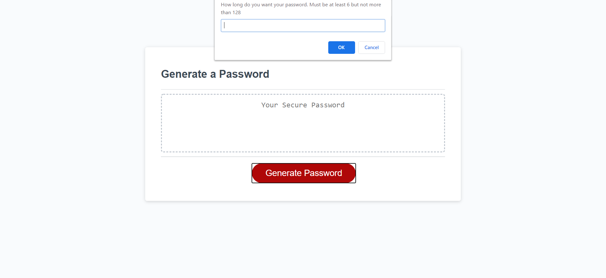
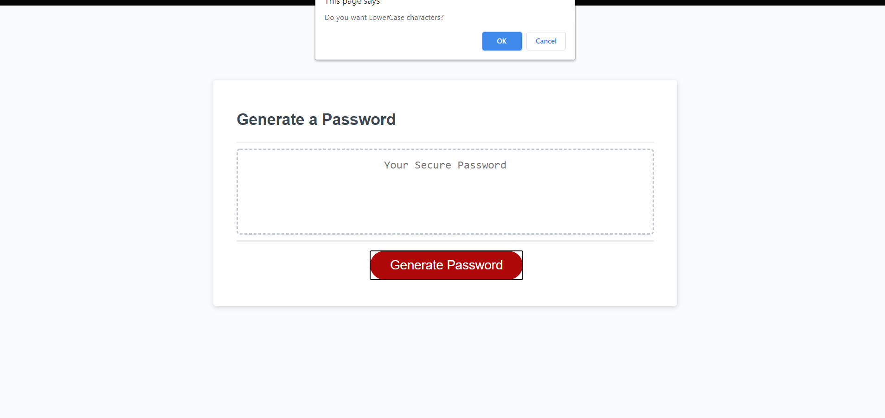
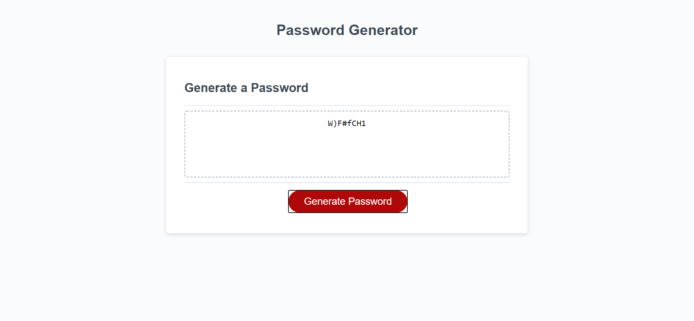

# Homework3.github.io

# Password Generator

For this assignment, I was tasked to write javascript so that when the Generate Password button is clicked, it outputs random characters. When the button is clicked, a question is prompted for the user to input the length they want their password to be.

When the number is inputed, it goes on to ask what characters would they would or would not like to include, example includes

;

This goes on until the last confirm, then password is generated

Link to the https://thaliarowan.github.io/homwork3.github.io/